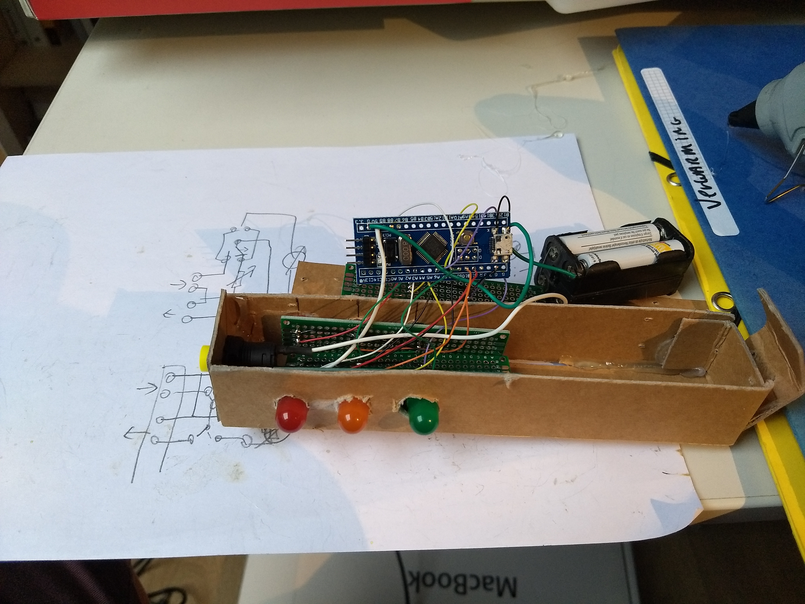

This is a very simple traffic light pattern for two roads crossing, to be used in a kid's toy.

Using platformio on a 'blue pill' stm32 board [1].

build and upload with:
    pio run -t upload

the platformio.ini is set to upload with another blue/black pill that is running the blackmagic probe firmware[2],
or you can upload the stm32duino USB bootloader [3], and change upload_protocol to dfu

[1] https://docs.platformio.org/en/latest/boards/ststm32/bluepill_f103c8.html
[2] grab yourself a build from the internet, I got mine from https://www.stm32duino.com/viewtopic.php?t=3546
[3] http://wiki.stm32duino.com/

